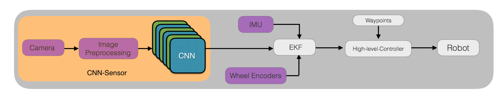

In this paper, we present a robust and real-time convolutional neural network (CNN)
based localization algorithm that can be implemented on cheap and low power computation
devices, thereby making it more practical. The proposed method rst trains a CNN that takes
RGB images from a monocular camera as input and performs regression for robot pose. It
then incorporates the output of the trained CNN in an Extended Kalman Filter (EKF) for
robot localization. Here we present a complete framework for localization of mobile robots in
GPS-denied indoor and outdoor environments that do not require costly and computationally
expensive sensors for real-time deployment. We demonstrate the performance of the proposed
approach using a low power GPU, NVIDIA Jetson TX1, mounted on an indoor and an outdoor
mobile robot platform. We show that the proposed approach gives promising results with
localization error of 0.3 m in indoor environments and 1.3 m in outdoor environments. This
makes CNN-sensors real-time, robust, low-cost and less computation-intensive substitutes for
other sensors, with immense potential for a wider use in mobile robotics.

Use [Google Scholar](https://scholar.google.com/scholar?q=Convolutional+Neural+Network+Based+Sensors+for+Mobile+Robot+Relocalization){:target="_blank"} for full citation