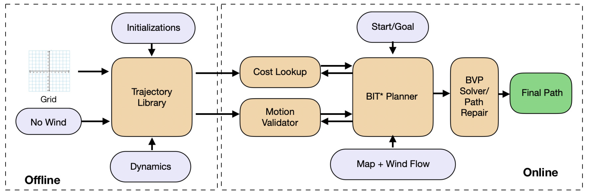

A key challenge in enabling autonomous Unmanned
Aerial Vehicles (UAVs) to operate in cluttered urban
environments is to plan collision-free, smooth, dynamically
feasible trajectories between two locations with the wind in realtime.
This paper presents a novel path planning strategy using
sampling-based planning that uses a two-point boundary value
problem (BVP) to connect states in the presence of wind. Unlike
most approaches that use a curvature discontinuous solution,
the proposed BVP is formulated as a nonlinear constrained optimization
problem with curvature and curvature-rate continuous
profile to generate smoother trajectories. To achieve real-time
performance, our method uses surrogate solutions from a precalculated
library while solving the planning problem and then
runs a repair routine to generate the final trajectory. To validate
the feasibility of the offline-online strategy, simulation results on
a 3D model of an actual city block with a realistic wind-field are
presented. Results with a trochoid-based BVP solver are also
presented for comparison. For the given simulation scenario,
we could demonstrate a 93% success rate for the algorithm in
finding a valid trajectory.

*Overall Approach: Offline, we generate a trajectory library of precomputed wind-agnostic BVP solutions on a
predefined grid. Online, we use the trajectory library to provide wind-aware surrogate solutions to perform real-time planning.
Only the surrogate solutions that are part of the final path are repaired to provide smooth collision-free wind-aware path.*

