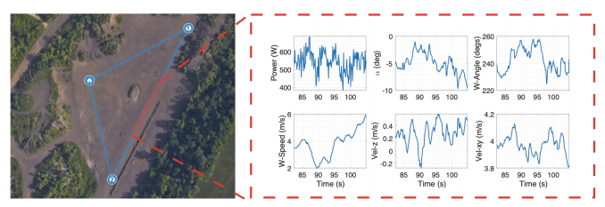

We autonomously direct a small quadcopter package delivery Uncrewed Aerial Vehicle (UAV) or "drone" to take off, fly a
specified route, and land for a total of 209 flights while varying a set of operational parameters. The vehicle was equipped with
onboard sensors, including GPS, IMU, voltage and current sensors, and an ultrasonic anemometer, to collect high-resolution
data on the inertial states, wind speed, and power consumption. Operational parameters, such as commanded ground speed,
payload, and cruise altitude, are varied for each flight. This large dataset has a total flight time of 10 hours and 45 minutes
and was collected from April to October of 2019 covering a total distance of approximately 65 kilometers. The data collected
were validated by comparing flights with similar operational parameters. We believe these data will be of great interest to the
research and industrial communities, who can use the data to improve UAV designs, safety, and energy efficiency, as well as
advance the physical understanding of in-flight operations for package delivery drones.

*Figure shows the GPS route and sample data outputs from the onboard sensor array*

