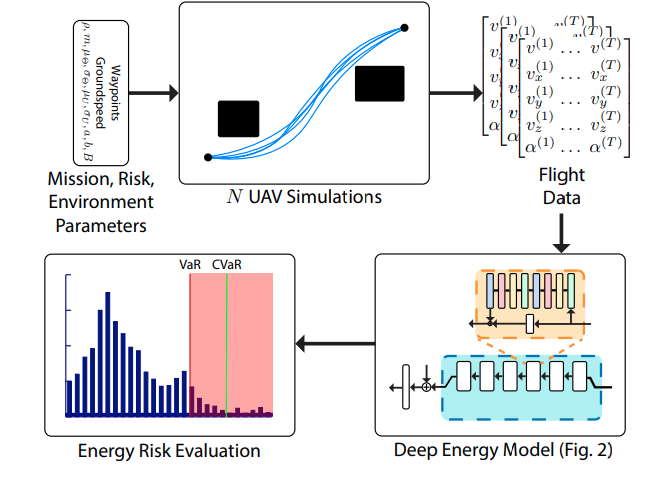

An important aspect of risk assessment for UAV
flights is energy consumption, as running out of battery during a
flight brings almost guaranteed vehicle damage and a high risk
of property damage or human injuries. Predicting the amount
of energy a flight will consume is challenging as many factors
affect the overall consumption. In this work, we propose a
deep energy model that uses Temporal Convolutional Networks
(TCNs) to capture the time varying features while incorporating
static contextual information. Our energy model is trained on a
real world dataset and doesn’t require segregating flights into
regimes. We showcase an improvement in power predictions
by 35.6% on test flights when compared to a state-of-the-art
analytical method. Once we have an accurate energy model, we
can use it to predict the energy usage for a given trajectory
and evaluate the risk of running out of battery during flight.
We propose using Conditional Value-at-Risk (CVaR) as a
metric for quantifying this risk. We show that CVaR captures
the risk associated with worst-case energy consumption on a
nominal path by transforming the output distribution of Monte
Carlo forward simulations into a risk space and computing
the CVaR on the risk-space distribution. Our state-of-the-art
energy model and risk evaluation method helps guarantee safe
flights and evaluate the coverage area from a proposed takeoff
location.

*Overview of the risk assessment pipeline*

