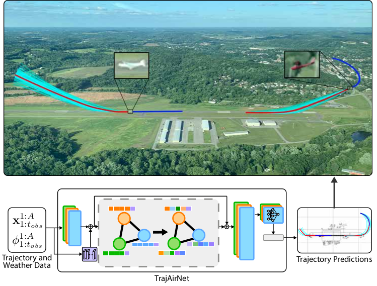

Pilots operating aircraft in un-towered airspace rely on their situational awareness and prior knowledge to predict the future trajectories of other agents. These predictions are conditioned on the past trajectories of other agents, agent-agent social interactions and environmental context such as airport location and weather. This paper provides a dataset, TrajAir, that captures this behaviour in a non-towered terminal airspace around a regional airport. We also present a baseline socially-aware trajectory prediction algorithm, TrajAirNet, that uses the dataset to predict the trajectories of all agents. The dataset is collected for 111 days over 8 months and contains ADS-B transponder data along with the corresponding METAR weather data. The data is processed to be used as a benchmark with other publicly available social navigation datasets. To the best of authors' knowledge, this is the first 3D social aerial navigation dataset thus introducing social navigation for autonomous aviation. TrajAirNet combines state-of-the-art modules in social navigation to provide predictions in a static environment with a dynamic context. Both the TrajAir dataset and TrajAirNet prediction algorithm are open-source. 

